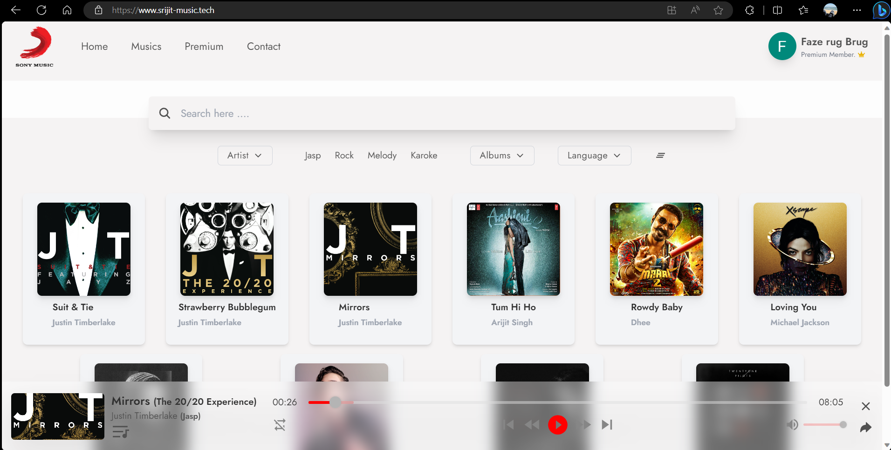

# Ethnus MERN B17 Music Streaming Service 🎵

### ✨ [Live Demo]([srijit-music.tech](https://www.srijit-music.tech/))

## Overview

This is the GitHub repository for a music streaming service that utilizes modern web technologies to deliver a seamless and enjoyable listening experience. The service is built on a back-end stack consisting of NodeJS, Express, and MongoDB, which provide a robust and scalable infrastructure for storing and serving music data. Firebase is used for user authentication and real-time updates, ensuring that the service is secure and responsive.  On the front-end, React is used to create a fast and dynamic user interface that allows users to search, browse, and play their favorite songs and playlists. The service also features social sharing capabilities, allowing users to share their music with friends and followers on popular social media platforms.  This GitHub repository contains all the code and resources needed to deploy and run the music streaming service. 

Team - B17

Project Title - Music Streaming Service

Brief Description - Online platform for streaming music

Included Technologies - MongoDB, Express.js, React.js, Node.js

Domain - Music

Expected Outcomes - Understanding of streaming protocols, user authentication, playlist management

## Technologies Used

Built on the MERN Stack with `NodeJs` `ReactJs` `Express` `Tailwind CSS` `Firebase` and `MongoDB` for Database Management and storage.

## Team Members

👤 **Nigam Mulchandani (20BCE10201)**  
👤 **Srijit Mishra (20BCE10203)**  
👤 **Abhishek prajapati (20BCE10208)**  
👤 **Satyam Singh (20BCE10215)**  

Leave a ⭐️ If you like this project!

- Website: [srijit-music.tech](https://www.srijit-music.tech/)

## Screenshot

